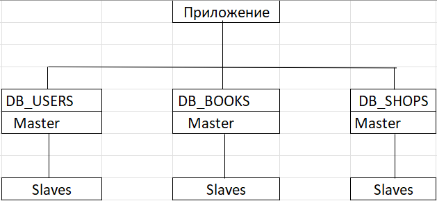

# Домашнее задание к занятию «Репликация и масштабирование. Часть 2»

---

### Задание 1

Опишите основные преимущества использования масштабирования методами:

- активный master-сервер и пассивный репликационный slave-сервер; 
- master-сервер и несколько slave-серверов;

*Дайте ответ в свободной форме.*

---

### Ответ:

#### Активный master + пассивный slave

Преимущества:

- Отказоустойчивость - slave можно быстро поднять как master при падении основного.

- Резервное копирование без нагрузки - бэкапы и проверки можно делать со slave.

- Простота архитектуры - легко настроить и поддерживать.

Минимальные риски рассинхронизации, так как один источник записи.

 Подходит, когда важна стабильность и простота, а нагрузка умеренная.

#### Master + несколько slave

Преимущества:

- Горизонтальное масштабирование чтения — нагрузка распределяется между slave.

- Высокая производительность при read-heavy нагрузке.

- Повышенная отказоустойчивость — выход одного slave не критичен.

- Гибкость — разные slave можно использовать под разные задачи (чтение, аналитика, бэкапы).

Подходит для систем с большим количеством запросов на чтение (веб-сервисы, API).

---

### Задание 2

Разработайте план для выполнения горизонтального и вертикального шаринга базы данных. База данных состоит из трёх таблиц: 

- пользователи, 
- книги, 
- магазины (столбцы произвольно). 

Опишите принципы построения системы и их разграничение или разбивку между базами данных.

*Пришлите блоксхему, где и что будет располагаться. Опишите, в каких режимах будут работать сервера.* 
---
### Ответ:

#### Вертикальный шаринг позволяет разделить базу данных по функциональному назначению, а горизонтальный — распределить большие объёмы данных между несколькими серверами.

#### Вертикальный шаринг:
 
- DB_USERS
Содержит таблицу users (id, email, password_hash, created_at).
Отвечает за авторизацию, аутентификацию и управление пользователями.

- DB_BOOKS
Содержит таблицу books (id, title, author, price).
Используется для хранения каталога книг, поиска и отображения информации.

- DB_SHOPS
Содержит таблицы shops (id, name, city) и stock (shop_id, book_id, quantity).
Отвечает за магазины и наличие книг.

Преимущества вертикального шаринга:

снижение нагрузки на одну базу данных;
логическое разграничение данных;
возможность независимого масштабирования и администрирования;
повышение безопасности за счёт разделения доступов.

#### Горизонтальный шаринг:

Пользователи:

Таблица users шардируется по идентификатору пользователя (user_id):

- users_shard_1 — пользователи с id 1–1 000 000

- users_shard_2 — пользователи с id 1 000 001–2 000 000

Выбор шарда осуществляется на уровне приложения по значению user_id.

Магазины:

Данные о магазинах шардируются по географическому признаку:

- DB_SHOPS_EU

- DB_SHOPS_US

- DB_SHOPS_ASIA

Это позволяет уменьшить задержки и распределить нагрузку по регионам.

Книги:

Таблица books не шардируется, так как является справочником. Для масштабирования используется репликация и кэширование.

#### Режимы работы серверов:
Для каждой базы данных использую схему master–slave:

#### Блок-схема:

 ---
